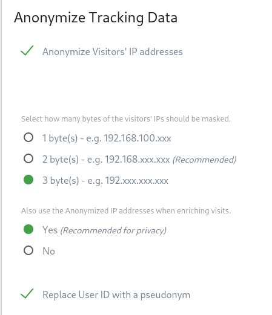
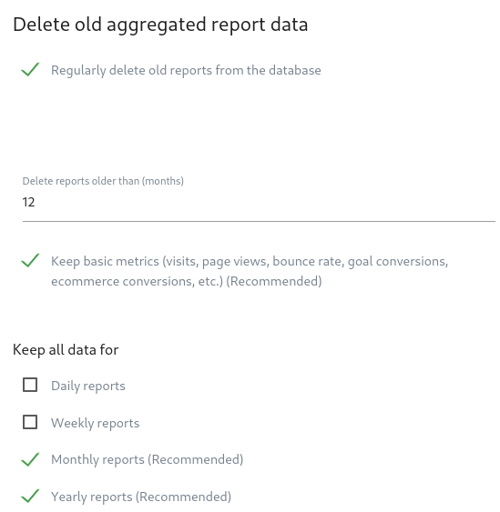

# [KYC, NOT ME](https://kycnot.me)
kycnot.me is a simple yet useful web page. It lists trusted Services where you can interact with Bitcoin or Monero without the need of KYC verification. You can easily compare and decide what's best for you.

**CONTENTS**
* [Why this](#why-this)
  * [Why only Bitcoin and Monero](#why-only-bitcoin-and-monero)
  * [Website has trackers?](#website-has-trackers)
* [FAQ](#FAQ)
  * [Decision making](#what-is-the-criteria)
  * [Unlisting reasons](#unlisting-reasons)
* [Contribute](#contribute)
  * [Donate](#donate)
* [Mentioned in](#mentioned-in)

## Why this
Cryptocurrencies are meant to make a change on the way we pay and exchange goods. They are made to untie the dependency between the users (customers) and the centralized entities that are in control (law enforced) of our economy (e.g. Banks, FED, etc.).

KYC and AML exchanges are the most common nowadays, they act exactly like a bank when using their wallets (most newbies or “traders” do so). You (usually) don't own any private key, so the funds aren't fully yours, they own your keys (if there are any keys that belong to you). They also require you to identify yourself in order to operate there (e.g. photo of your ID). All of this together goes against the most valuable benefits of cryptocurrencies.

With KYCNOT.ME I want to make it easier for people to find trustworthy ways to buy, exchange, trade and use cryptos without needing to identify themselves, and preserving the decentralized and self-governed essence of Cryptocurrencies.

### Why only Bitcoin and Monero
Bitcoin because is the biggest, with the most market cap, most adoption and most used among all cryptos. Monero because it is the true digital money, the only one that preserves privacy by design and brings true fungibility.

### Website has trackers?
Actually I have set up the free version of Matomo web analytics. [Matomo](https://matomo.org/) gathers analytics in a completely privacy-respecting way. I will be setting up a self-hosted version of Matomo so I will completely control the data myself.

Matomo is [completely open source](https://github.com/matomo-org/matomo), so the code can be studied. If you have any doubts I encourage you to take a look at Matomo's code and their website.

I want to have analytics for my site as I want to know if it is worth it to continue developing features for it, or if I have to improve certain things. The analytics data will **never** be sold.

I will leave screenshots of the Matomo privacy configuration I have set:

## FAQ

I will try to answer some of the most common questions.

#### Why is "X" not listed?
There my be many reasons to this question. For now, I'm alone with this project and my time is limited and before adding a Exchange/Merchant/Service I need to make some investigation in order to be sure that it compiles with the NON-KYC requirements. So one of the reasons, if it was suggested is that maybe I haven't had the time to investigate on it. If you're patient I promise I will be investigating all the suggerences I recieve.

#### Will *this* feature be implemented?
Again, I'm alone with this. I would love to be implementing a lot of thing I have in mind but time is limited and I am not fulltime on this, in fact I have a job and several personal projects at the moment. The time I am dedicating to kycnot.me is limited and I would really like to be able to dedicate it much more time.

As I will always say, contributors are **very** welcome.

#### Why Open Source?
Well, it's not a very big service / project (maybe in the future will grow) but I really believe in Open Source. I want people to be able to contribute with it, request features, to make suggestions and I want as well to interact with them. I am not a company, I'm a individual who wants to make the usage of cryptos fairer and try to preserve its good characteristics.

#### What is the criteria?
Well, there's not (*yet*) a well established criteria on the decision-making process. But the following are points which I think I really value (not the only ones, nor the decisive ones) when choosing a service to be listed:

- [ ] Open Source-ness
- [ ] Decentralization
- [ ] No lock of funds if KYC is requested for some reason
- [ ] Ammout of personal data required to register
- [ ] No registration needed
- [ ] Tor mirrors
- [ ] Good reviews, active on social networks, etc.
- [ ] Clear and readable Terms of Service

### Unlisting reasons:
* LocalBitcoins unlisted - 2020.06.12 - Reason: [#26](https://github.com/pluja/kycnot/issues/26)
* Binance unlisted - 2020.06.13 - Reason: [#24](https://github.com/pluja/kycnot/issues/24)
* BitQuick unlisted - 2020.06.14 - Reason: [#25](https://github.com/pluja/kycnot/issues/25)

## Contribute
Suggestions about listing new Exchanges must be commented [here](https://github.com/pluja/kycnot/issues/15)

Contributions are very welcome. Any suggestion, recommendation, correction, idea... Just open a Github issue and I'll fix it as quick as I can.

Also, **active contributors** are wanted! I am alone with this and my time is limited.

### The project itself:
I want the site to use as little JS as possible (as when I have some time I want to add a non-JS version plus a Tor mirror for the site), so all suggestions will be evaluated before being added. Also, I won't have any backend in the near future, only frontend. I may be adding backend at some point if the project grows.

[The list of changes can be found here](CHANGELOG.md)

I'll be setting up a self-hosted Matomo instance for analytics (Not only for this site, but for several personal projects).

**FYI: I'm not a web developer.**

### Donate
* Bitcoin: `3NgdEH6tDEi28AqLeKyB4sApvZR14k8gCU`
* Monero: `82ZG8jKCBbdhyxRffWUcmQC5DSHT9LF1JWASe8Efy5ZGDjm4FxLQuks7R3iNs8xY9UVeZxkV5terminnW6AAuCQZExZiRPN`

## Mentioned in:
KYCNOT.me has been mentioned in:
* [decrypt.co](https://decrypt.co/32233/looking-for-bitcoin-with-no-kyc-this-new-site-has-you-covered)
* [cointelegraph](https://cointelegraph.com/news/website-compiles-list-of-kyc-free-exchanges-along-with-some-warnings)
* [James Lopp Twitter](https://nitter.net/lopp/status/1271417720018534400)
* [kryptokumpel](https://www.kryptokumpel.de/boerse/auf-der-suche-nach-boersen-ohne-kyc-neue-webseite-kyc-not-me-listet-verbleibende-boersen-ohne-know-your-customer-verfahren/)
* [estudiobitcoin](https://estudiobitcoin.com/comprar-y-vender/)

